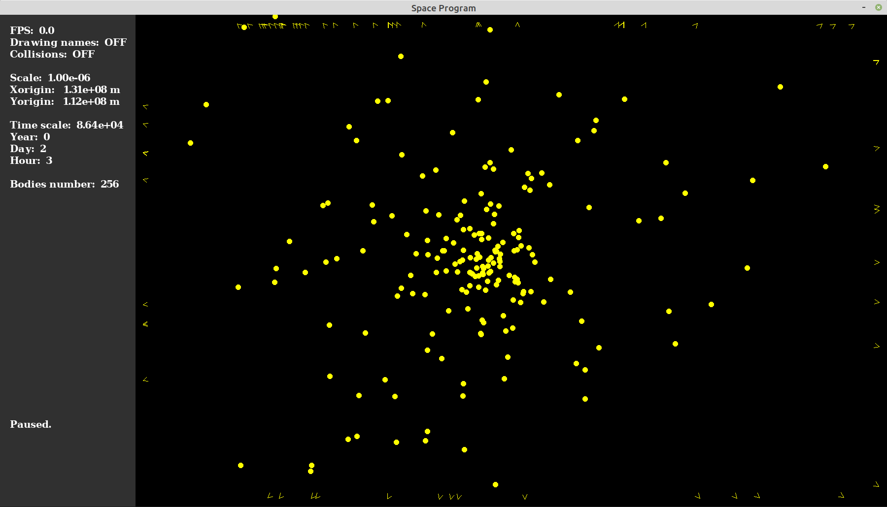

# Space Program

*Just simulating the universe*




## Installation

Only Linux (Ubuntu) is supported at this time.

* Installing the graphical library SDL2, and some FreeType fonts:

```
sudo apt install libsdl2-dev libsdl2-image-dev libsdl2-ttf-dev libfreetype6-dev fonts-dejavu
```


## Compilation

Compiling is done by running ``` make ```.


## Runtime

Try the program by running the command below, with an optional integer argument between 0 and 2:

```
./spaceprogram.exe
```


## Known issues

SDL2 v2.0.10 causes a drawing bug: rendering something changes the color of a specific pixel of the last drawn object. This bug however is not present in versions 2.0.8 and 2.0.14. Should it arise, uninstall the libsdl2-dev package, then install [this one](https://packages.debian.org/sid/libsdl2-2.0-0) and [this one.](https://packages.debian.org/source/sid/libsdl2) Finally, libsdl2-image-dev and libsdl2-ttf-dev may need to be updated after that.


## Using Docker

Both the compiling and the runtime GUI can be containerized using [Docker](https://docs.docker.com/engine/install). If using that, make sure to rebuild the image with each code change. Additionally, [Docker Compose](https://docs.docker.com/compose/install) is also supported.

Limitations:
- For now, this only works on Linux.
- This is not space efficient: the resulting image weights 580 Mb (``` busybox:1.33.1-glibc ``` couldn't be used due to libraries (SDL2) needing to be linked, and static executable failed to build).

#### With vanilla Docker

Buiding the image:

```
sudo docker build -t gui-app:1.0 .
```

Running the containerized GUI, with runtime arg ``` 2 ```:

```
sudo docker run \
	--net=host \
	--env=DISPLAY \
	--volume=$HOME/.Xauthority:/root/.Xauthority:rw \
	gui-app:1.0 \
	./spaceprogram.exe 2
```

#### With Docker Compose

Buiding the image:

```
sudo docker-compose build
```

Running the containerized GUI:

```
sudo COMMAND="./spaceprogram.exe 2" HOME=$HOME docker-compose up
```

Note: $HOME content should be user's home directory, not ``` /root/ ```. Giving said HOME arg was necessary on Ubuntu 20.04, but not needed on CentOS 7.
